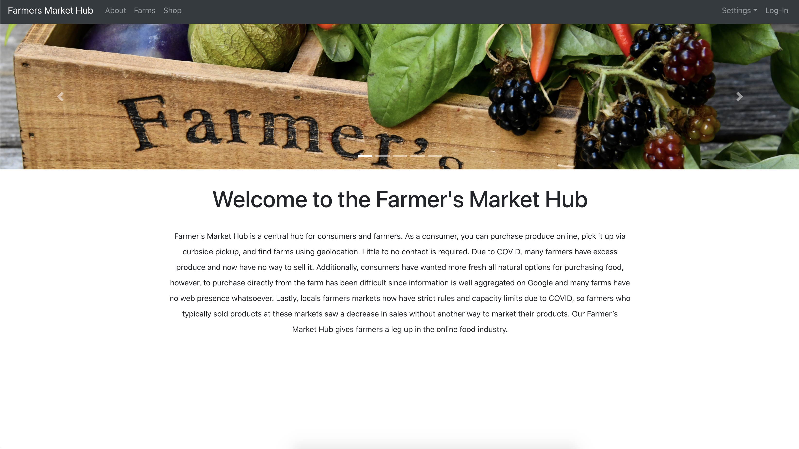

# Farmer's Market Hub

<p align="center">
  
</p>


## About The Project

The Farmer's Market Hub is a central hub for farmers and customers. Due to COVID-19, many farmers have excess produce with no way to sell it, while consumers find it difficult to purchase directly from farms as few farms have an online presence. Further, local farmers markets now have strict rules and capacity limits due to COVID-19, so farmers who typically sold products at these markets saw a decrease in sales. With this website, consumers can find nearby farms using geolocation (Visa Merchant Locator API), purchase produce online (Visa Checkout API), and pick up orders via curbside pickup to avoid direct contact. Farmers can easily manage items and fulfill orders as well. The Farmer’s Market Hub gives farmers a leg up in the online food industry.

## Built With
* MongoDB
* Express
* React
* Node.js

## Getting Started
After downloading the repository, in one terminal, run:
```sh
cd backend
npm install
node server.js
```

After the database connection is established successfully, open another terminal and run:

```sh
npm start
```

This should open up the locally hosted website in your web browser. Or use [http://localhost:3000](http://localhost:3000). 

## Try Out
* Create a merchant or a customer account.
* As a merchant, navigate to the Item Manager to add new items to sell, change the price of existing items, update items to in stock/out of stock, and remove items. Go to the Orders tab to see orders that customers purchased from you.
* As a consumer, check out the Farms tab to find farms near you, the Shop tab to browse for produce and pay using Visa Checkout, and the Orders tab to view your orders. 
